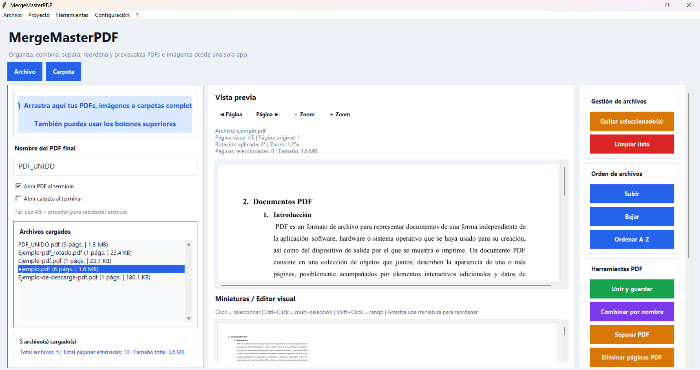
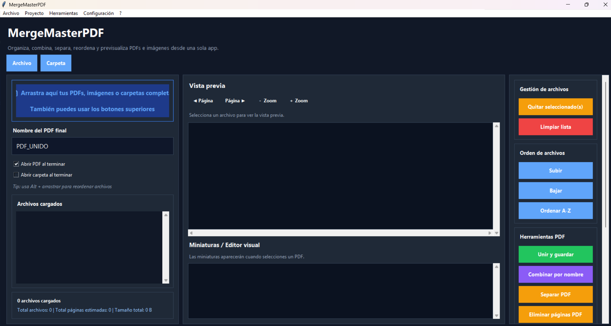
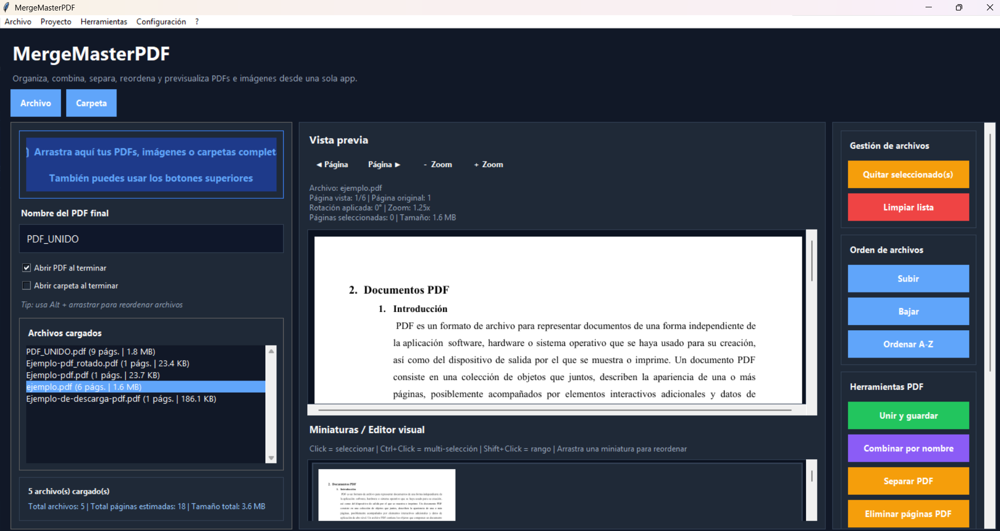
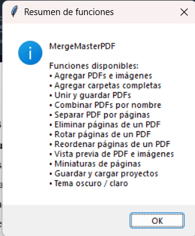

# MergeMasterPDF

MergeMasterPDF is a desktop application to organize, merge, split, reorder and preview PDF files and images from a single interface.

## Features
- Merge PDFs
- Combine PDFs by name
- Split PDFs
- Delete pages
- Rotate pages
- Reorder pages
- Preview and thumbnails
- Visual page editor
- Drag & drop support
- Save and load projects
- Dark / Light theme
- Help menu with shortcuts and version info

## Download
Download the latest version from the Releases section:
https://github.com/Magicjg/MergeMasterPDF/releases

## Screenshots

### Main window

### Preview and thumbnails

### Visual editor

## Download
Download the latest version from the Releases section:
https://github.com/Magicjg/MergeMasterPDF/releases

## License
Free for personal use.
Commercial use requires permission.

## Author
Alan Juarez
